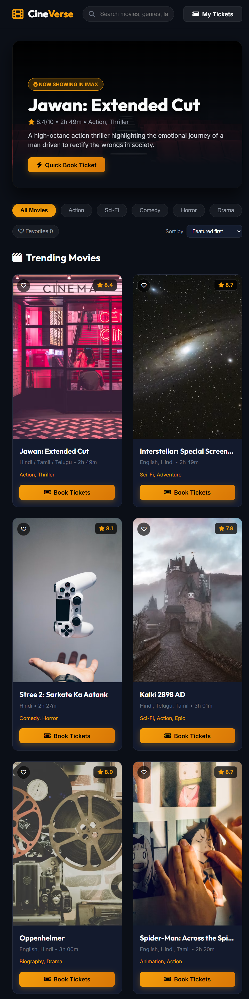

# CineVerse Movie Booking App

A Flask-based movie ticket booking application with movie discovery, showtime selection, visual seat booking, checkout, digital tickets, favorites, and booking lookup.



## Features

- Browse featured and currently available movies
- Search by movie title or genre
- Filter by genre
- Sort by featured order, rating, price, or title
- Save favorite movies in the browser
- Select date, showtime, screen, and seats
- VIP, Prime, and Standard seat pricing
- Server-side seat and payment validation
- Digital ticket with booking code
- Search bookings by code, email, or phone number
- Print-friendly ticket view
- Movie-themed browser tab icon

## Requirements

- Python 3.9+
- Flask
- Flask-CORS

## Setup

1. Open a terminal in the project folder.
2. Install dependencies:

   ```powershell
   pip install -r requirements.txt
   ```

3. Start the server:

   ```powershell
   python app.py
   ```

4. Open the app at [http://127.0.0.1:5000](http://127.0.0.1:5000).

## Tests

Run the automated API tests with:

```powershell
python -m unittest test_app.py
```

Compile-check the Python files with:

```powershell
python -m py_compile app.py database.py
```

## Project Structure

```text
movie_booking_app/
├── app.py                 # Flask routes and booking validation
├── database.py            # SQLite schema and seed data
├── movies.db              # Local SQLite database
├── requirements.txt       # Python dependencies
├── test_app.py            # API tests
└── static/
    ├── index.html         # Application page
    ├── app.js             # UI state and API interactions
    ├── style.css          # Responsive visual styling
    ├── favicon.svg        # Browser tab movie icon
    └── movie-booking-home.png  # Application output screenshot
```

## API Endpoints

| Method | Endpoint | Purpose |
| --- | --- | --- |
| GET | `/api/movies` | List movies with optional search and genre filters |
| GET | `/api/movies/<movie_id>` | Get movie details |
| GET | `/api/showtimes/<movie_id>` | Get showtimes for a movie |
| POST | `/api/bookings` | Create a validated booking |

## Live Link - https://movie-booking-app-47bu.onrender.com/##


| GET | `/api/bookings/<query>` | Find bookings by code, email, or phone |
